<div align="center">
<picture>
  <source media="(prefers-color-scheme: dark)" srcset=".github/brand/banner-night.svg">
  
</picture>
<br><br>
<a href="#what-its-meant-to-be"><picture><source media="(prefers-color-scheme: dark)" srcset=".github/brand/tab-what-its-meant-to-be-night.svg"></picture></a>
<a href="#status"><picture><source media="(prefers-color-scheme: dark)" srcset=".github/brand/tab-status-night.svg"></picture></a>
</div>

<p>
<a name="what-its-meant-to-be"></a>
<picture><source media="(prefers-color-scheme: dark)" srcset=".github/brand/section-what-its-meant-to-be-night.svg"></picture>
</p>

A base network-visualization engine — real-time packet ingestion rendered as a live graph in WebGL, with a plugin API for extensions.

> Note: this is a separate, unrelated experiment from [Setka](https://github.com/NoamFav/Setka), which also touches network visualization but is a different (and further along) Go project.

<p>
<a name="status"></a>
<picture><source media="(prefers-color-scheme: dark)" srcset=".github/brand/section-status-night.svg"></picture>
</p>

| | Today | Planned |
|---|-------|---------|
| `main.rs` | Prints `"NetViz engine starting..."` and exits | Engine bootstrap, packet ingestion loop |
| `renderer.rs` | Empty placeholder | WebGL-based graph renderer, plugin API |

> [!NOTE]
> No rendering or packet ingestion exists yet — this is a two-file scaffold, not a working tool.

```sh
git clone https://github.com/NoamFav/NetViz && cd NetViz
cargo run
```

<div align="center">
Made with ♥ by <a href="https://github.com/NoamFav">NoamFav</a>
</div>

<br>

<a href="https://nf-software.com">
<picture>
  <source media="(prefers-color-scheme: dark)" srcset=".github/brand/footer-night.svg">
  
</picture>
</a>
